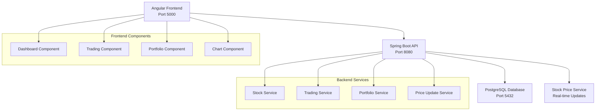

# StockChart Cloud - Real-Time Financial Trading Platform

## Overview

A modern, real-time financial trading application featuring live stock price updates, interactive charts, and portfolio management. Built as a demo platform with a $100,000 starting balance for seamless trading simulation.

## Key Features

- **Real-Time Stock Prices** - Live updates every 5 seconds
- **Interactive Charts** - Dynamic price visualization with Chart.js
- **Portfolio Management** - Track holdings, P&L, and balance
- **Trading Operations** - Execute buy/sell orders instantly
- **Transaction History** - Complete trading activity log
- **No Authentication** - Direct access for demo purposes

## Tech Stack

### Frontend

| Technology | Version | Purpose |
|------------|---------|---------|
| Angular | 17.3.0 | SPA Framework |
| TypeScript | 5.4.2 | Type Safety |
| Chart.js | 4.5.1 | Data Visualization |
| RxJS | 7.8.0 | Reactive Programming |

### Backend

| Technology | Version | Purpose |
|------------|---------|---------|
| Spring Boot | 3.2.0 | REST API Framework |
| Java | 17 | Programming Language |
| PostgreSQL | 16 | Database |
| Maven | 3.x | Build Tool |

### Additional Technologies

- Spring Security (CORS Only)
- Spring Data JPA (ORM)
- Lombok (Code Generation)

## Architecture



## Project Structure

```
StockChartCloud/
├── frontend/                   # Angular Application
│   ├── src/app/
│   │   ├── components/         # UI Components
│   │   │   └── dashboard/      # Trading Dashboard
│   │   ├── services/           # API Services
│   │   └── models/             # TypeScript Interfaces
│   ├── angular.json            # Angular Configuration
│   └── package.json            # Dependencies
│
├── backend/                    # Spring Boot API
│   ├── src/main/java/com/trading/app/
│   │   ├── controller/         # REST Controllers
│   │   ├── service/            # Business Logic
│   │   ├── model/              # JPA Entities
│   │   ├── repository/         # Data Access
│   │   └── config/             # Configuration
│   └── pom.xml                 # Maven Dependencies
│
└── README.md                   # This file
```

## Quick Start

### Prerequisites
- Java 17+
- Node.js 20+
- PostgreSQL 16+
- Maven 3.x

### Running the Application

#### 1. Start Backend
```bash
cd backend
mvn spring-boot:run
```
Backend runs on: `http://localhost:8080`

#### 2. Start Frontend
```bash
cd frontend
npm install
npm start
```
Frontend runs on: `http://localhost:5000`

## API Endpoints

### Stock Operations
```http
GET    /api/stocks/all              # Get all stocks
GET    /api/stocks/{symbol}         # Get stock details
GET    /api/stocks/{symbol}/price   # Get current price
```

### Trading Operations
```http
POST   /api/trades/execute          # Execute trade
GET    /api/trades/history          # Trade history
GET    /api/trades/recent           # Recent trades
```

### Portfolio Management
```http
GET    /api/portfolio               # Portfolio holdings
GET    /api/portfolio/summary       # Portfolio summary
```

## Demo Features

| Feature | Description | Status |
|---------|-------------|--------|
| Real-time Updates | 5-second price refresh | Active |
| Live Charts | Interactive price charts | Active |
| Authentication | Disabled for demo | Disabled |
| Responsive Design | Mobile-friendly UI | Active |

## Cloud Deployment Ready

This application is designed for containerization and AWS deployment:

- **Docker** - Container packaging
- **AWS ECS/EKS** - Container orchestration
- **AWS RDS** - Managed PostgreSQL
- **AWS ALB** - Load balancing
- **CloudWatch** - Monitoring

### Deployment Architecture
- **Docker** - Container packaging
- **AWS ECS/EKS** - Container orchestration
- **AWS RDS** - Managed PostgreSQL
- **AWS ALB** - Load balancing
- **CloudWatch** - Monitoring

## Configuration

### CORS Settings
```java
// Backend allows requests from:
- localhost:5000 (Angular dev server)
- 127.0.0.1:5000
```

### Database Configuration
```properties
# PostgreSQL connection
spring.datasource.url=jdbc:postgresql://localhost:5432/trading_db
spring.jpa.hibernate.ddl-auto=update
```

## Performance Metrics

| Metric | Value | Description |
|--------|-------|-------------|
| Update Frequency | 5 seconds | Stock price refresh rate |
| Default Balance | $100,000 | Demo trading capital |
| API Response | <100ms | Average response time |
| Mobile Support | 100% | Responsive design coverage |

## Contributing

1. Fork the repository
2. Create feature branch (`git checkout -b feature/amazing-feature`)
3. Commit changes (`git commit -m 'Add amazing feature'`)
4. Push to branch (`git push origin feature/amazing-feature`)
5. Open Pull Request

## License

This project is licensed under the MIT License - see the [LICENSE](LICENSE) file for details.

## Acknowledgments

- **Chart.js** - Beautiful chart visualizations
- **Spring Boot** - Robust backend framework
- **Angular** - Powerful frontend framework
- **PostgreSQL** - Reliable database system

---

**Built with love for financial trading simulation**
