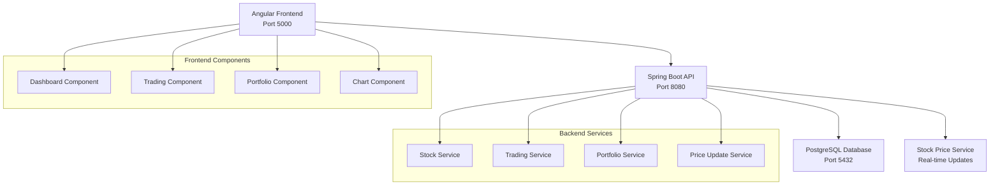

# 📈 StockChart Cloud - Real-Time Financial Trading Platform

<div align="center">


</div>

## 🚀 Overview

A modern, real-time financial trading application featuring live stock price updates, interactive charts, and portfolio management. Built as a demo platform with a $100,000 starting balance for seamless trading simulation.

## ✨ Key Features

- 🔄 **Real-Time Stock Prices** - Live updates every 5 seconds
- 📊 **Interactive Charts** - Dynamic price visualization with Chart.js
- 💰 **Portfolio Management** - Track holdings, P&L, and balance
- 📈 **Trading Operations** - Execute buy/sell orders instantly
- 📋 **Transaction History** - Complete trading activity log
- 🎯 **No Authentication** - Direct access for demo purposes

## 🛠️ Tech Stack

### 🎨 Frontend
<div align="center">

| Technology | Version | Purpose |
|------------|---------|---------|
|  | 17.3.0 | SPA Framework |
|  | 5.4.2 | Type Safety |
|  | 4.5.1 | Data Visualization |
|  | 7.8.0 | Reactive Programming |

</div>

### ⚙️ Backend
<div align="center">

| Technology | Version | Purpose |
|------------|---------|---------|
|  | 3.2.0 | REST API Framework |
|  | 17 | Programming Language |
|  | 16 | Database |
|  | 3.x | Build Tool |

</div>

### 🔧 Additional Technologies
<div align="center">


</div>

## 🏗️ Architecture



## 📁 Project Structure

```
StockChartCloud/
├── 🎨 frontend/                 # Angular Application
│   ├── src/app/
│   │   ├── components/         # UI Components
│   │   │   └── dashboard/      # Trading Dashboard
│   │   ├── services/           # API Services
│   │   └── models/             # TypeScript Interfaces
│   ├── angular.json            # Angular Configuration
│   └── package.json            # Dependencies
│
├── ⚙️ backend/                  # Spring Boot API
│   ├── src/main/java/com/trading/app/
│   │   ├── controller/         # REST Controllers
│   │   ├── service/            # Business Logic
│   │   ├── model/              # JPA Entities
│   │   ├── repository/         # Data Access
│   │   └── config/             # Configuration
│   └── pom.xml                 # Maven Dependencies
│
└── 📚 README.md                # This file
```

## 🚀 Quick Start

### Prerequisites
- ☕ Java 17+
- 📦 Node.js 20+
- 🐘 PostgreSQL 16+
- 🔧 Maven 3.x

### 🏃‍♂️ Running the Application

#### 1️⃣ Start Backend
```bash
cd backend
mvn spring-boot:run
```
🌐 Backend runs on: `http://localhost:8080`

#### 2️⃣ Start Frontend
```bash
cd frontend
npm install
npm start
```
🌐 Frontend runs on: `http://localhost:5000`

## 🔌 API Endpoints

### 📈 Stock Operations
```http
GET    /api/stocks/all              # Get all stocks
GET    /api/stocks/{symbol}         # Get stock details
GET    /api/stocks/{symbol}/price   # Get current price
```

### 💱 Trading Operations
```http
POST   /api/trades/execute          # Execute trade
GET    /api/trades/history          # Trade history
GET    /api/trades/recent           # Recent trades
```

### 💼 Portfolio Management
```http
GET    /api/portfolio               # Portfolio holdings
GET    /api/portfolio/summary       # Portfolio summary
```

## 🎯 Demo Features

<div align="center">

| Feature | Description | Status |
|---------|-------------|--------|
| 💰 Starting Balance | $100,000 demo cash | ✅ Active |
| 🔄 Real-time Updates | 5-second price refresh | ✅ Active |
| 📊 Live Charts | Interactive price charts | ✅ Active |
| 🛡️ Authentication | Disabled for demo | ❌ Disabled |
| 📱 Responsive Design | Mobile-friendly UI | ✅ Active |

</div>

## ☁️ Cloud Deployment Ready

This application is designed for containerization and AWS deployment:

<div align="center">


</div>

### 🏗️ Deployment Architecture
- 🐳 **Docker** - Container packaging
- 🚀 **AWS ECS/EKS** - Container orchestration
- 🗄️ **AWS RDS** - Managed PostgreSQL
- ⚖️ **AWS ALB** - Load balancing
- 📊 **CloudWatch** - Monitoring

## 🔧 Configuration

### CORS Settings
```java
// Backend allows requests from:
- localhost:5000 (Angular dev server)
- 127.0.0.1:5000
- Replit domains (if needed)
```

### Database Configuration
```properties
# PostgreSQL connection
spring.datasource.url=jdbc:postgresql://localhost:5432/trading_db
spring.jpa.hibernate.ddl-auto=update
```

## 📊 Performance Metrics

<div align="center">

| Metric | Value | Description |
|--------|-------|-------------|
| 🔄 Update Frequency | 5 seconds | Stock price refresh rate |
| 💾 Default Balance | $100,000 | Demo trading capital |
| 🌐 API Response | <100ms | Average response time |
| 📱 Mobile Support | 100% | Responsive design coverage |

</div>

## 🤝 Contributing

1. 🍴 Fork the repository
2. 🌿 Create feature branch (`git checkout -b feature/amazing-feature`)
3. 💾 Commit changes (`git commit -m 'Add amazing feature'`)
4. 📤 Push to branch (`git push origin feature/amazing-feature`)
5. 🔄 Open Pull Request

## 📄 License

This project is licensed under the MIT License - see the [LICENSE](LICENSE) file for details.

## 🙏 Acknowledgments

- 📊 **Chart.js** - Beautiful chart visualizations
- 🌱 **Spring Boot** - Robust backend framework
- 🅰️ **Angular** - Powerful frontend framework
- 🐘 **PostgreSQL** - Reliable database system

---

<div align="center">

**Built with ❤️ for financial trading simulation**


</div>
